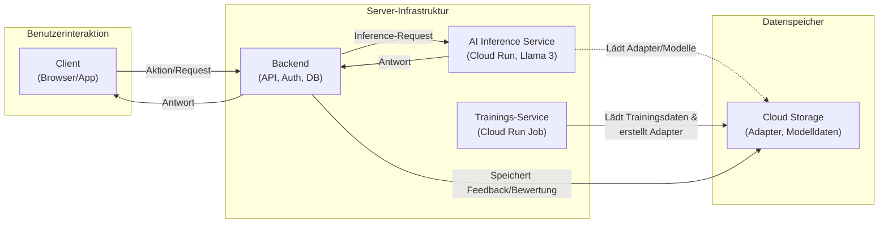

# Last-Strawberry: Ein KI-gesteuertes Text-Abenteuer

**Last-Strawberry** ist ein dynamisches, erzählerisches Text-Abenteuer, das von einem fine-getunten Large Language Model (Meta Llama 3 8B) angetrieben wird. Das Projekt zeichnet sich durch eine skalierbare 3-teilige Cloud-Architektur und einen einzigartigen zweistufigen KI-Prozess aus, der für eine reichhaltige, interaktive und konsistente Spielwelt sorgt.


## Übersicht

Dieses Projekt ist mehr als nur ein Spiel; es ist eine komplette Plattform für KI-gestütztes Storytelling, inklusive Werkzeugen zur Verbesserung der KI durch Nutzerfeedback und automatisierte Trainings-Pipelines.

* **World Creation**

    

* **Web-Client Gameplay**

    

* **Admin-Panel zur Steuerung**
  
    

---

## Features

* **Dynamische, KI-generierte Erzählung:** Kein festes Skript. Die Geschichte entwickelt sich basierend auf den Aktionen des Spielers.
* **Zweistufiger KI-Prozess:**
    1.  **Analyse-Modell:** Ein spezialisiertes Modell extrahiert strukturierte Befehle (`ROLL_CHECK`, `NPC_CREATE`, etc.) aus dem Spielgeschehen.
    2.  **Erzähl-Modell:** Ein kreativ feingetuntes, welt-spezifisches Modell generiert die eigentliche Geschichte basierend auf den Befehlen und dem Spieler-Input.
* **Vollständige Charaktererstellung:** Spieler erstellen ihre Charaktere mit Namen, Hintergrundgeschichte und einem "Point-Buy"-System für Attribute.
* **Level-Up-System:** Charaktere sammeln Erfahrungspunkte und können bei Stufenaufstiegen ihre Attribute verbessern.
* **Multi-Client-Architektur:** Spielbar über einen modernen Web-Client oder einen funktionsreichen Desktop-Client (PySide6).
* **DM-/Admin-Werkzeuge:** Integrierte Tools erlauben es Game Mastern, die KI-Antworten live zu korrigieren und so hochwertige Trainingsdaten für das nächste Re-Training zu generieren.
* **Automatisierte Trainings-Pipelines:** Skripte zur Automatisierung des Fine-Tunings der Analyse- und Erzähl-Modelle.

---

## Architektur

Das Projekt basiert auf einer modernen, entkoppelten 3-teiligen Architektur, die für Skalierbarkeit und Wartbarkeit ausgelegt ist.



1.  **Frontend (Web-Client & Desktop-Client)**
    * Die Benutzeroberfläche für den Spieler.
    * Kommuniziert ausschließlich über eine REST-API mit dem Backend-Server.
    * **Technologien:** HTML, TailwindCSS, JavaScript (Web); Python, PySide6 (Desktop).

2.  **Backend-Server (Root-Server)**
    * Das Gehirn der Anwendung. Läuft als `systemd`-Dienst auf einem dedizierten Server.
    * Verwaltet Benutzer-Accounts, Sessions, Spielstände und die gesamte Spiellogik.
    * Orchestriert die Anfragen an den KI-Dienst.
    * **Technologien:** Python, FastAPI, Uvicorn, SQLite, Nginx (Reverse Proxy).

3.  **AI Service (Google Cloud Run)**
    * Ein dedizierter, GPU-beschleunigter Microservice für die rechenintensive KI-Inferenz.
    * Lädt die Basismodelle und wendet dynamisch welt-spezifische LoRA-Adapter an.
    * Vollständig von der Spiellogik entkoppelt, um unabhängig skalieren zu können.
    * **Technologien:** Python, FastAPI, Docker, Google Cloud Run, PyTorch, Hugging Face (Transformers, PEFT, bitsandbytes).

---

## 🚀 Alpha-Test & Zugang

**Last-Strawberry befindet sich aktuell in einer geschlossenen Alpha-Phase.**  
Wir vergeben exklusive Zugänge an Interessierte, die bereit sind, aktiv Feedback zu geben und die Plattform in ihrer Entwicklung mitzugestalten.

### **Wie bekomme ich Zugang?**

- Schick uns eine Nachricht über GitHub (Issue oder Direct Message)
- **ODER** nutze das Kontaktformular auf [signz-vision.de](https://signz-vision.de)

Du erhältst dann individuelle Zugangsdaten sowie alle Informationen zur Teilnahme am Alpha-Test.  
Die Anzahl der Alpha-Plätze ist limitiert!

> **Dein Feedback ist entscheidend, um Last-Strawberry noch besser zu machen.**  
> Werde Teil der Entwicklung und sichere dir jetzt den frühen Zugang!

---

## Technologie-Stack

* **Backend:** Python, FastAPI, Uvicorn, SQLite
* **KI/ML:** PyTorch, Hugging Face Transformers, PEFT (LoRA), bitsandbytes, Llama 3 8B Instruct
* **Frontend:** HTML, TailwindCSS, JavaScript, PySide6
* **Deployment & Infrastruktur:** Docker, Google Cloud Run, Nginx, Plesk, systemd

---

## Setup & Installation

Eine detaillierte Anleitung zur Einrichtung der verschiedenen Komponenten.

### 1. AI Service (Google Cloud)

Der KI-Dienst wird als Docker-Container auf Google Cloud Run mit einer GPU-Instanz bereitgestellt.

```bash
# Beispielhafter Befehl zur Bereitstellung
gcloud run deploy last-strawberry-ai-service --source ./ai_service \
  --region=europe-west4 --allow-unauthenticated \
  --args=--port,8080 --min-instances=1 \
  --accelerator=type=nvidia-l4,count=1
```

### 2. Backend-Server (Linux/Ubuntu)

Der Backend-Server wird als `systemd`-Dienst eingerichtet.

```bash
# 1. Projekt klonen
git clone [DEINE_GIT_REPOSITORY_URL] last-strawberry-backend
cd last-strawberry-backend

# 2. Python venv erstellen und aktivieren
python3 -m venv venv
source venv/bin/activate

# 3. Abhängigkeiten installieren
pip install -r backend_server/requirements.txt

# 4. systemd Service konfigurieren und starten
sudo nano /etc/systemd/system/last-strawberry.service
# (Inhalt aus der Anleitung einfügen)
sudo systemctl daemon-reload
sudo systemctl start last-strawberry.service
sudo systemctl enable last-strawberry.service

# 5. Nginx als Reverse Proxy einrichten (z.B. in Plesk)
```

### 3. Web-Frontend

Die Dateien aus dem `web_frontend`-Ordner werden in den Web-Root des Webservers kopiert (z.B. `/var/www/vhosts/deine-domain.de/httpdocs/`). Die `API_BASE_URL` in `script.js` und `admin.js` muss auf die öffentliche Domain des Backends zeigen.

---

## Mitarbeit & Lokalisierung

**Aktueller Status:** Das Projekt ist derzeit vollständig auf **Deutsch** ausgelegt. Dies betrifft sowohl die Benutzeroberfläche (Web & Desktop) als auch die Prompt-Vorlagen (`templates/regeln.py`), die das Verhalten der KI steuern.

**Hilf mit!**
Wir sind offen für Beiträge, um Last-Strawberry in andere Sprachen zu übersetzen. Wenn du dabei helfen möchtest, das Projekt zu lokalisieren, wären dies die wichtigsten Bereiche:

* **UI-Texte:** Übersetzung der Oberflächenelemente in den `*.html`- und `*.py`-Dateien der Clients.
* **Prompt-Vorlagen:** Anpassung und Übersetzung der System-Prompts in `templates/regeln.py`, um die KI in einer anderen Sprache zu instruieren.

Wenn du Interesse hast, erstelle bitte ein "Issue" auf GitHub, um die Koordination zu besprechen, oder reiche direkt einen "Pull Request" mit deinen Änderungen ein.

---

## Lizenz

Dieses Projekt ist unter der MIT-Lizenz lizenziert. Weitere Informationen finden Sie in der `LICENSE`-Datei.
