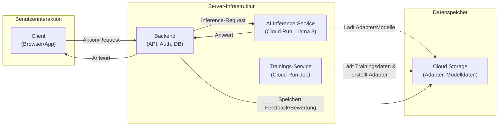

# Last-Strawberry: Ein KI-gesteuertes Text-Abenteuer

**Last-Strawberry** ist ein dynamisches, erzählerisches Text-Abenteuer, das von einem fine-getunten Large Language Model (Meta Llama 3 8B) angetrieben wird. Das Projekt zeichnet sich durch eine skalierbare 3-teilige Cloud-Architektur und einen einzigartigen dreistufigen KI-Prozess aus, der für eine reichhaltige, interaktive und konsistente Spielwelt sorgt.


## Übersicht

Dieses Projekt ist mehr als nur ein Spiel; es ist eine komplette Plattform für KI-gestütztes Storytelling, inklusive Werkzeugen zur Verbesserung der KI durch Nutzerfeedback und automatisierte Trainings-Pipelines.

* **World Creation**

    

* **Web-Client Gameplay**

    

* **Admin-Panel zur Steuerung**
  
    

---

## Features

### 🎮 **Spielerlebnis**
* **Dynamische, KI-generierte Erzählung:** Kein festes Skript. Die Geschichte entwickelt sich basierend auf den Aktionen des Spielers.
* **Dreistufiger KI-Workflow:** 
    1.  **Player Analysis:** Extraktion von Spieler-Intentionen und Befehlen aus dem Input
    2.  **Story Generation:** Kreative Erzählung basierend auf analysiertem Input und Weltkontext  
    3.  **Consequence Analysis:** Automatische Analyse der Story-Auswirkungen für Konsistenz
* **Vollständige Charaktererstellung:** Namen, Hintergrundgeschichte und "Point-Buy"-System für Attribute.
* **Level-Up-System:** Erfahrungspunkte sammeln und Attribute bei Stufenaufstiegen verbessern.

### 🛠️ **Entwickler & DM Tools** 
* **Live-KI-Korrektur-System:** Game Master können KI-Antworten in Echtzeit korrigieren und damit sofort Trainingsdaten für das nächste Re-Training generieren.
* **Enhanced AI Service Logging:** Detaillierte Protokollierung aller KI-Anfragen mit Adapter-Typ, Prompt-Previews und Antwortlängen für besseres Debugging.
* **Automatisierte Trainings-Pipelines:** Vollständig automatisierte Fine-Tuning-Skripte für Analyse- und Erzähl-Modelle.
* **Story Export & Analytics:** Komplette Abenteuer exportieren in verschiedenen Formaten (TXT, Markdown, JSON) mit detaillierten Statistiken.

### 🏗️ **Architektur & Performance**
* **Multi-Client-Architektur:** Spielbar über modernen Web-Client oder funktionsreichen Desktop-Client (PySide6).
* **Google Cloud Integration:** Authentifizierte, skalierbare KI-Services mit automatischer GPU-Zuweisung.
* **Robuste Benutzeraverwaltung:** Vollständiges Admin-Panel mit Rollen-Management und Profil-Verwaltung.

---

## Architektur

Das Projekt basiert auf einer modernen, entkoppelten 3-teiligen Architektur, die für Skalierbarkeit und Wartbarkeit ausgelegt ist.



1.  **Frontend (Web-Client & Desktop-Client)**
    * Die Benutzeroberfläche für den Spieler.
    * Kommuniziert ausschließlich über eine REST-API mit dem Backend-Server.
    * **Technologien:** HTML, TailwindCSS, JavaScript (Web); Python, PySide6 (Desktop).

2.  **Backend-Server (Root-Server)**
    * Das Gehirn der Anwendung. Läuft als `systemd`-Dienst auf einem dedizierten Server.
    * Verwaltet Benutzer-Accounts, Sessions, Spielstände und die gesamte Spiellogik.
    * Orchestriert die Anfragen an den KI-Dienst.
    * **Technologien:** Python, FastAPI, Uvicorn, SQLite, Nginx (Reverse Proxy).

3.  **AI Service (Google Cloud Run)**
    * Ein dedizierter, GPU-beschleunigter Microservice für die rechenintensive KI-Inferenz.
    * Lädt die Basismodelle und wendet dynamisch welt-spezifische LoRA-Adapter an.
    * Vollständig von der Spiellogik entkoppelt, um unabhängig skalieren zu können.
    * **Technologien:** Python, FastAPI, Docker, Google Cloud Run, PyTorch, Hugging Face (Transformers, PEFT, bitsandbytes).

---

## 🚀 Alpha-Test & Zugang

**Last-Strawberry befindet sich aktuell in einer geschlossenen Alpha-Phase.**  
Wir vergeben exklusive Zugänge an Interessierte, die bereit sind, aktiv Feedback zu geben und die Plattform in ihrer Entwicklung mitzugestalten.

### **Wie bekomme ich Zugang?**

- Schick uns eine Nachricht über GitHub (Issue oder Direct Message)
- **ODER** nutze das Kontaktformular auf [signz-vision.de](https://signz-vision.de)

Du erhältst dann individuelle Zugangsdaten sowie alle Informationen zur Teilnahme am Alpha-Test.  
Die Anzahl der Alpha-Plätze ist limitiert!

> **Dein Feedback ist entscheidend, um Last-Strawberry noch besser zu machen.**  
> Werde Teil der Entwicklung und sichere dir jetzt den frühen Zugang!

---

## Technologie-Stack

### 🏗️ **Backend & API**
* **Backend:** Python 3.11+, FastAPI, Uvicorn, SQLite
* **Authentication:** OAuth2, JWT-Tokens, Google Cloud IAM Integration
* **API Features:** RESTful endpoints, CORS-enabled, comprehensive error handling

### 🤖 **KI/ML Pipeline**
* **Models:** Meta Llama 3 8B Instruct (Base), Custom LoRA Adapters
* **Frameworks:** PyTorch, Hugging Face Transformers, PEFT (LoRA), bitsandbytes
* **Inference:** GPU-accelerated (NVIDIA L4), Dynamic adapter switching
* **Training:** Automated fine-tuning pipelines, Quality-labeled training data

### 🎨 **Frontend & UI**
* **Web Client:** HTML5, TailwindCSS, Vanilla JavaScript, Modern CSS Grid
* **Desktop Client:** Python, PySide6, Native OS integration
* **Admin Interface:** Real-time correction tools, Statistics dashboards

### ☁️ **Deployment & Infrastructure**
* **Containerization:** Docker, Multi-stage builds, Optimized images
* **Cloud Services:** Google Cloud Run, Cloud Storage, Container Registry
* **Server Infrastructure:** Nginx (Reverse Proxy), systemd services, Plesk management
* **Monitoring:** Enhanced logging, Request tracking, Performance metrics

---

## 🔄 Neueste Entwicklungen & Updates

### **Version 1.4.0 - Enhanced AI Workflow & DM Tools** *(Juli 2025)*

#### 🆕 **Neue Features:**
- **Live-Korrektur-Interface:** DM können KI-Antworten direkt im Web-Client korrigieren
  - Modal-Interface zum Editieren von `ai_output` und `extracted_commands_json`
  - Automatische Markierung korrigierter Daten als Qualitäts-Trainingsdaten
  - Backend-API Endpunkte: `/get_last_event`, `/save_event_correction`

- **Enhanced AI Service Logging:** 
  - Detaillierte Protokollierung aller KI-Anfragen mit Emojis und Typisierung
  - Sichtbarkeit des dreistufigen Workflows: `🎯 ANALYSIS → 📖 NARRATIVE → 📊 ANALYSIS`
  - Prompt-Previews und Response-Längen für besseres Debugging

- **Story Export System:**
  - Export kompletter Abenteuer in TXT, Markdown und JSON
  - Metadaten-Integration und formatierte Ausgabe
  - Welt-Statistiken und Analytics-Dashboard

#### 🔧 **Technische Verbesserungen:**
- **Dreistufiger KI-Workflow:** Optimierte Analyse-Pipeline für bessere Konsistenz
- **Database Schema Updates:** Neue Felder für Korrektur-Tracking und Qualitätslabels
- **Frontend State Management:** Verbesserte Input-Field Behandlung nach AI-Responses
- **Google Cloud Authentication:** Robuste Token-Verwaltung für Cloud Run Services

#### 🐛 **Bugfixes:**
- **Input Field Locking:** Eingabefelder bleiben nach KI-Antworten entsperrt
- **Data Mapping:** Korrektur der `summary`/`response` Feld-Zuordnung im Frontend
- **Database Consistency:** Behebung von `char_id`/`player_id` Schema-Konflikten
- **Error Handling:** Verbesserte Fehlerbehandlung in AI Service und Backend

---

## Setup & Installation

Eine detaillierte Anleitung zur Einrichtung der verschiedenen Komponenten.

### 1. AI Service (Google Cloud)

Der KI-Dienst wird als Docker-Container auf Google Cloud Run mit einer GPU-Instanz bereitgestellt.

```bash
# Docker Image bauen und deployen
cd ai_service
docker build -t last-strawberry-ai-service:latest .

# Für Google Cloud Run taggen und pushen
docker tag last-strawberry-ai-service:latest gcr.io/YOUR_PROJECT_ID/last-strawberry-ai-service:latest
docker push gcr.io/YOUR_PROJECT_ID/last-strawberry-ai-service:latest

# Deploy zu Cloud Run mit GPU
gcloud run deploy last-strawberry-ai-service \
  --image=gcr.io/YOUR_PROJECT_ID/last-strawberry-ai-service:latest \
  --region=europe-west4 --allow-unauthenticated \
  --port=8080 --min-instances=1 \
  --accelerator=type=nvidia-l4,count=1 \
  --memory=8Gi --cpu=2
```

### 2. Backend-Server (Linux/Ubuntu)

Der Backend-Server wird als `systemd`-Dienst eingerichtet.

```bash
# 1. Projekt klonen
git clone [DEINE_GIT_REPOSITORY_URL] last-strawberry-backend
cd last-strawberry-backend

# 2. Python venv erstellen und aktivieren
python3 -m venv venv
source venv/bin/activate

# 3. Abhängigkeiten installieren
pip install -r backend_server/requirements.txt

# 4. Google Cloud Credentials einrichten
# Platziere key.json in backend_server/key.json

# 5. Konfiguration anpassen
# AI_SERVICE_URL in backend_server/main.py auf deine Cloud Run URL setzen

# 6. systemd Service konfigurieren und starten
sudo nano /etc/systemd/system/last-strawberry.service
sudo systemctl daemon-reload
sudo systemctl start last-strawberry.service
sudo systemctl enable last-strawberry.service

# 7. Nginx als Reverse Proxy einrichten (z.B. in Plesk)
```

### 3. Web-Frontend

```bash
# Frontend-Dateien deploymen
cp -r web_frontend/* /var/www/vhosts/deine-domain.de/httpdocs/

# API-URLs konfigurieren
# Setze API_BASE_URL in script.js und admin.js auf deine Backend-Domain
```

### 4. DM-Tools & Training Setup

```bash
# Trainingsdaten für verbesserte KI generieren
# Nach Spielsessions mit Korrekturen:
python trainer/train_analyst.py
python trainer/train_narrative.py [WORLD_ID] "[WORLD_NAME]"

# Automatische Backups und Datenanalyse
python tools/generate_analysis_data_from_db.py
```

---

## 🛠️ DM-Tools & Entwicklungsworkflow

### **Live-Korrektur-System**

Das integrierte DM-Tool ermöglicht es, KI-Generierte Inhalte in Echtzeit zu korrigieren und für das Training zu optimieren:

1. **Korrektur-Modal öffnen:** Nach jeder KI-Antwort im Web-Client verfügbar
2. **AI Output editieren:** Direkte Bearbeitung der generierten Story-Texte
3. **Commands anpassen:** JSON-Editor für strukturierte Befehle (`ROLL_CHECK`, `NPC_CREATE`, etc.)
4. **Automatische Qualitätslabels:** Korrigierte Daten werden als High-Quality Training-Data markiert

### **Training-Pipeline**

```bash
# 1. Spielsession mit Korrekturen durchführen
# 2. Analyse-Modell mit korrigierten Daten trainieren
python trainer/train_analyst.py

# 3. Narrative-Modell für spezifische Welt trainieren  
python trainer/train_narrative.py 1 "Mystische_Welt"

# 4. Neue Adapter zu Cloud Storage hochladen
# 5. AI Service mit neuen Adaptern neu deployen
```

### **Monitoring & Analytics**

- **Enhanced Logging:** Alle KI-Requests werden mit Adapter-Typ und Prompt-Preview geloggt
- **Export-System:** Komplette Abenteuer als TXT/Markdown/JSON exportieren
- **Statistiken:** Detaillierte Metriken über Spielerverhalten und KI-Performance
- **Quality Tracking:** Verfolgung der Verbesserung durch korrigierte Trainingsdaten

---

## Mitarbeit & Lokalisierung

### **🌍 Internationalisierung**
**Aktueller Status:** Das Projekt ist derzeit vollständig auf **Deutsch** ausgelegt. Dies betrifft sowohl die Benutzeroberfläche (Web & Desktop) als auch die Prompt-Vorlagen (`templates/regeln.py`), die das Verhalten der KI steuern.

**Hilf mit bei der Übersetzung:**
* **UI-Texte:** Übersetzung der Oberflächenelemente in den `*.html`- und `*.py`-Dateien der Clients.
* **Prompt-Vorlagen:** Anpassung und Übersetzung der System-Prompts in `templates/regeln.py`, um die KI in einer anderen Sprache zu instruieren.
* **Dokumentation:** README und Anleitungen in weitere Sprachen übersetzen.

### **🚀 Roadmap & Geplante Features**

#### **Kurzfristig (Q1 2025)**
- [ ] **Multi-Language Support:** Englische UI und Prompts
- [ ] **Advanced DM Dashboard:** Erweiterte Statistiken und Kontroll-Tools  
- [ ] **Mobile Web-Client:** Optimierte Touch-Interfaces
- [ ] **Automated Testing:** Umfassende Test-Suite für alle Komponenten

#### **Mittelfristig (Q2-Q3 2025)**  
- [ ] **Multiplayer Support:** Mehrere Spieler in einer Welt
- [ ] **Voice Integration:** Spracheingabe und Text-to-Speech
- [ ] **Custom World Templates:** Benutzer-erstellte Welt-Vorlagen
- [ ] **Advanced Analytics:** Machine Learning für Spieler-Verhalten

#### **Langfristig (2025+)**
- [ ] **Marketplace:** Community-Hub für Welten und Mods
- [ ] **AI-Generated Assets:** Bilder, Sounds und Musik-Generierung

### **🤝 Contributing Guidelines**

1. **Fork** das Repository und erstelle einen Feature-Branch
2. **Teste** deine Änderungen lokal mit dem Development-Setup
3. **Dokumentiere** neue Features in der README und Code-Kommentaren
4. **Erstelle** einen Pull Request mit ausführlicher Beschreibung

**Prioritäre Bereiche für Contributions:**
- 🌐 **Internationalisierung** (EN, FR, ES, IT)
- 🧪 **Testing & QA** (Unit Tests, Integration Tests)
- 📱 **Mobile Optimization** (Responsive Design, PWA)
- 🎨 **UI/UX Improvements** (Accessibility, Design System)

---

## 📄 Lizenz & Acknowledgments

Dieses Projekt ist unter der **MIT-Lizenz** lizenziert. Weitere Informationen finden Sie in der `LICENSE`-Datei.

### **🙏 Credits & Dependencies**
- **Meta Llama 3 8B Instruct** - Base Language Model
- **Hugging Face** - Transformers, PEFT, und Model Hub
- **Google Cloud Platform** - Infrastructure und GPU Computing
- **FastAPI** - High-performance Python API Framework
- **TailwindCSS** - Utility-first CSS Framework

### **📞 Support & Community**
- **Issues & Bugs:** [GitHub Issues](https://github.com/leratos/Last-Strawberry/issues)
- **Feature Requests:** [GitHub Discussions](https://github.com/leratos/Last-Strawberry/discussions)
- **Alpha Access:** [signz-vision.de](https://signz-vision.de)

---

<div align="center">

**⭐ Star das Projekt wenn es dir gefällt! ⭐**

*Entwickelt mit ❤️ für die Community*

</div>
